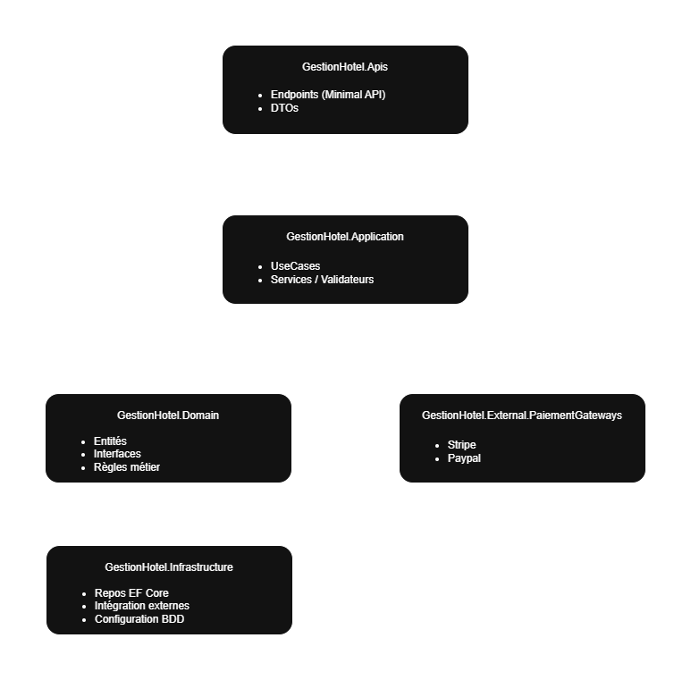
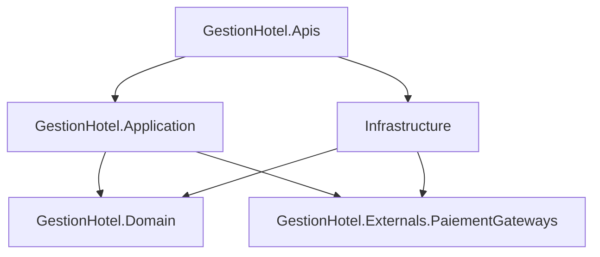

# Gestion d'Hôtel — TP Architecture .NET 8

## Objectif

Ce projet a pour objectif de mettre en œuvre une architecture logicielle propre (Clean Architecture) dans un contexte métier simple : la gestion d’un hôtel avec des réservations, paiements, check-in/out et gestion des chambres. Le tout est structuré autour de bonnes pratiques : séparation des couches, injection de dépendances, gestion des rôles utilisateurs, et mise en place d’authentification via JWT.

---

## Technologies utilisées

* .NET 8
* ASP.NET Core Web API
* Entity Framework Core (Provider : Pomelo MySQL)
* MySQL Workbench
* JWT (Json Web Tokens)
* Swagger / OpenAPI
* Clean Architecture
* Visual Studio 2022

---

## Structure du projet

```
GestionHotel.sln
├── GestionHotel.Apis              // Couche API (endpoints, DTO, configuration)
├── GestionHotel.Application       // Use cases, services métier, validation
├── GestionHotel.Domain            // Entités, interfaces, enums, règles métiers
├── GestionHotel.Infrastructure    // Repositories, EF Core, contextes, paiement
├── GestionHotel.Externals.PaiementGateways // Adaptateurs Stripe / Paypal
```

## Mise en route

### Prérequis

* [.NET 8 SDK](https://dotnet.microsoft.com/en-us/download)
* [MySQL Server](https://dev.mysql.com/downloads/mysql/)
* [MySQL Workbench](https://www.mysql.com/products/workbench/)
* [Visual Studio 2022 Community](https://visualstudio.microsoft.com/fr/vs/community/)

### Installation de l'outil `dotnet ef`

Dans un terminal, installez les outils de migration EF Core si ce n’est pas déjà fait :

```bash
dotnet tool install --global dotnet-ef
```
### Configuration

Configurer votre base de données dans le fichier :

```
GestionHotel.Apis/appsettings.json
```

Exemple de chaîne de connexion :

```json
"ConnectionStrings": {
  "DefaultConnection": "server=localhost;port=3306;database=gestion_hotel;user=root;password=motdepasse"
},
"Jwt": {
  "Key": "JWT_KEY"
}
```

### Création de la base de données

Depuis la racine du projet :

```bash
dotnet ef database update --project GestionHotel.Infrastructure
```

## Lancement de l’application

Depuis Visual Studio :

* Démarrer le projet `GestionHotel.Apis` (API REST)
* Swagger est disponible à l’adresse :
  `https://localhost:7208/swagger`

---

## Rôles & Comptes disponibles

* **Client**

  * Email : [client@mail.com](mailto:client@mail.com)
  * Mot de passe : `password`
* **Réceptionniste**

  * Email : [receptionist@mail.com](mailto:receptionist@mail.com)
  * Mot de passe : `password`
* **Personnel de ménage**

  * Email : [cleaner@mail.com](mailto:cleaner@mail.com)
  * Mot de passe : `password`

(Identifiants simulés — intégration de l’authentification par rôle via JWT.)

---

## Fonctionnalités implémentées

| Fonctionnalité                | Description                                           |
| ----------------------------- | ----------------------------------------------------- |
| Authentification / JWT        | Génération et validation de token JWT avec rôle       |
| Création de client            | Création d’un compte client                           |
| Connexion                     | Login avec token JWT                                  |
| Réservation de chambre        | Choix de dates, nombre de personnes, types de chambre |
| Paiement                      | Paiement via Stripe ou Paypal (Utilisation de le `GestionHotel.Externals.PaiementGateways`)       |
| Check-in                      | Validation d’arrivée pour une réservation et payement si ce n'est pas fait         |
| Annulation de réservation     | Annulation conditionnelle (rôle client ou réception)  |
| Check-out                     | Départ, chambres marquées comme à nettoyer            |
| Liste des chambres à nettoyer | Filtrage des chambres par priorité de nettoyage       |
| Marquage de chambre nettoyée  | Validation par le personnel de ménage                 |

---

## Schémas d'architecture


### Clean Architecture


---

### Diagramme de dépendance



---

## Bonus / Fonctionnalités en cours

* Signalement de casse au check-out (implémentation prévue, structure en place)
* Notification automatique via service externe (non activé)
* Statistiques ou dashboard pour la réception

---

## Notes techniques

* Le contexte EF (`HotelDbContext`) est injecté via `Program.cs`
* L’authentification JWT est configurée dans `Program.cs` avec validation du rôle dans les endpoints
* Les données d’exemple peuvent être injectées manuellement via SQL ou ajoutées par endpoints

---

## Conclusion

Le projet respecte les principes de Clean Architecture avec séparation stricte des responsabilités. Tous les cas d’usage principaux ont été implémentés, et le système est prêt à être étendu par de nouveaux modules (notifications, dashboard, planning ménage, etc.).
